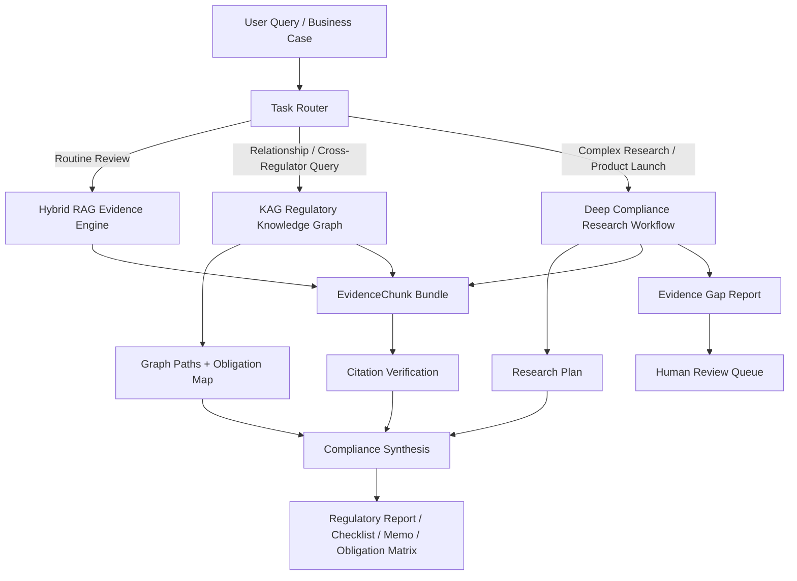
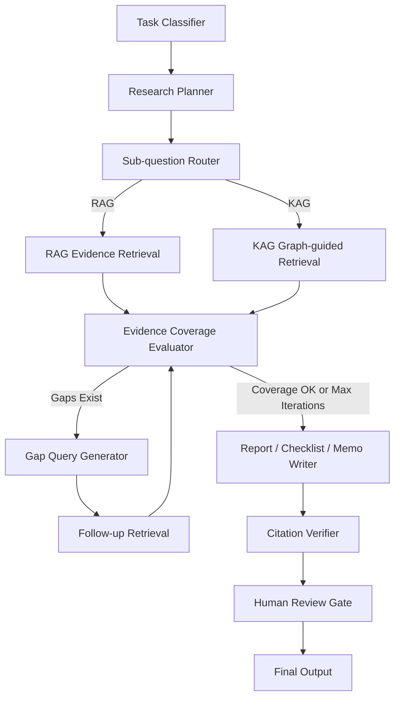

# HK-FinReg AI 优化方案：面向“可扩展的香港金融监管智能分析平台”的 KAG 与 Deep Research 升级设计

> 适用仓库：`https://github.com/EthanChan04/HK-FinReg_AI.git`  
> 当前定位升级：从“四个固定合规审查模块”升级为“可扩展的香港金融监管智能分析平台”  
> 版本建议：v2.5 → v3.0 Roadmap  
> 生成日期：2026-05-13

---

## 0. 执行摘要

本次 v3.0 计划将 HK-FinReg AI 从“4 个固定审查模块”升级为“可扩展的香港金融监管智能分析平台”，并明确三层能力分工：

```text
HK-FinReg AI
= Hybrid RAG Evidence Engine
+ Regulatory Knowledge Graph (KAG) Layer
+ Deep Compliance Research Workflow
```

- `RAG 主线`：默认路径，负责常规合规检索、证据召回与引用校验。
- `KAG 关系层`：负责跨监管机构关系推理、义务映射、风险-控制关联。
- `Deep Research 研究层`：负责复杂场景下的多轮研究、证据缺口分析与结构化报告。

本次重构新增两条硬约束：
1. `KAG / Deep Research` 功能必须以回归指标达标为前提逐步开放，不允许“先上线后补验证”。
2. `Obligation Mapper` 必须建立 20-50 个黄金样例回归体系，并作为版本发布闸门。

默认路由原则：

```text
默认 RAG，满足条件才升级到 KAG / Deep Research。
```

目标不是让每个请求都走重流程，而是让系统在“准确性、可解释性、成本与时延”之间可控升级。
## 1. 外部监管趋势依据：为什么要从四模块扩展到平台化

香港金融监管环境正在从传统单点合规，逐步走向：

- AI / GenAI 在金融服务中的负责任应用；
- 跨监管机构协同；
- 数据隐私与 AI 模型治理；
- 金融机构 AI 使用的 human oversight；
- 反欺诈、风险管理、客户体验等高价值 AI 场景；
- 银行、证券、保险、MPF、SVF 等多领域联动。

可作为项目升级依据的官方材料包括：

1. **香港政府：金融市场负责任应用 AI 政策声明**  
   - 2024-10-28 发布。  
   - 强调金融机构应制定 AI governance strategy，并采用 risk-based approach；human oversight 是缓解风险的重要机制。  
   - 官方链接：`https://www.info.gov.hk/gia/general/202410/28/P2024102800154p.htm`

2. **HKMA / SFC / IA / MPFA：GenA.I. Sandbox++**  
   - 2026-03-05 发布。  
   - 由 HKMA、SFC、IA、MPFA 与 Cyberport 推出。  
   - 覆盖 banking、securities and capital markets、asset and wealth management、insurance、MPF、stored value facilities。  
   - 关注 risk management、anti-fraud、customer experience，以及 “A.I. vs. A.I.” 策略。  
   - 官方链接：`https://www.hkma.gov.hk/eng/news-and-media/press-releases/2026/03/20260305-3/`

3. **PCPD：Artificial Intelligence: Model Personal Data Protection Framework**  
   - 2024-06-11 发布。  
   - 面向机构采购、实施、使用 AI，包括生成式 AI 时的个人资料保护最佳实践。  
   - 官方链接：`https://www.pcpd.org.hk/english/news_events/media_statements/press_20240611.html`

4. **SFC：Circular on Generative AI Language Models**  
   - 面向 licensed corporations 使用 generative AI language models 的风险管理。  
   - 官方链接：`https://apps.sfc.hk/edistributionWeb/api/circular/list-content/circular/intermediaries/supervision/doc?lang=EN&refNo=24EC55`

这些材料说明：香港金融监管中的 AI、数据、跨机构合规与产品上线治理正在成为真实需求。因此，项目若升级为“香港金融监管智能分析平台”，KAG 和 Deep Research 就有明确产品价值。

---

## 2. 当前代码基础分析

### 2.1 已有 RAG 底座

当前检索模块主要位于：

```text
backend/app/services/agents/builder.py
backend/app/services/retrieval/retrieval_service.py
backend/app/services/retrieval/retrieval_router.py
backend/app/services/retrieval/query_classifier.py
```

已有能力包括：

- 使用 `OpenAIEmbeddings` 兼容接口调用智谱 embedding；
- 使用 ChromaDB 作为向量库；
- 使用 BM25 作为 sparse retriever；
- 自定义 `HybridRetriever`；
- 使用 RRF 融合 BM25 与 Dense retrieval；
- 根据 query 类型动态调整 BM25 / Dense 权重；
- 可选 Cohere reranker；
- 将文档转换为 `EvidenceChunk`；
- 支持 metadata filter；
- 对高优先级文档做 `priority_boost()`。

当前 RAG 层已经足以支撑四个固定合规审查模块，是项目最成熟、最应该保留为主线的部分。

---

### 2.2 当前 KAG 层现状

当前 KAG 相关文件包括：

```text
backend/app/services/kag/graph_builder.py
backend/app/services/kag/graph_store.py
backend/app/services/kag/graph_retriever.py
backend/app/services/kag/graph_reasoner.py
backend/app/services/kag/ontology.py
```

当前 `graph_builder.py` 的图谱关系较轻量，主要是：

```text
Document --issued_by--> Regulator
Document --related_to--> Topic
Document --applies_to--> Product
Document --contains--> Chunk
Document --supported_by--> Chunk
```

当前 `NetworkXGraphStore` 使用 NetworkX 的 `DiGraph`，并通过 node-link JSON 持久化到本地文件。

当前 `GraphRetriever` 的查询方式比较简单，主要通过 query term 与 node title 做字符串匹配，然后返回：

```json
{
  "path": ["Regulator", "Document", "Topic"],
  "matched_node": "...",
  "matched_doc_ids": ["..."],
  "matched_topics": ["..."]
}
```

这说明当前 KAG 仍是 “metadata-derived lightweight graph”，并不是真正的监管义务图谱。

---

### 2.3 当前 Deep Research 层现状

当前 Deep Research 相关文件包括：

```text
backend/app/schemas/deepresearch.py
backend/app/services/deepresearch/planner.py
backend/app/services/deepresearch/workflow.py
backend/app/services/deepresearch/evidence_evaluator.py
backend/app/services/deepresearch/gap_detector.py
backend/app/services/deepresearch/report_writer.py
backend/app/api/routers/research.py
```

现有 workflow 大致为：

```text
planner
  → retrieval
  → evidence_evaluator
  → gap_retriever
  → evidence_evaluator
  → report_writer
  → citation_verifier
```

当前 `planner.py` 使用 deterministic fallback plan，默认拆出：

```text
SQ1: HKMA requirements
SQ2: SFC / conduct obligations
SQ3: AML/CFT and CDD obligations
SQ4: AI governance, privacy, and consumer protection risks
```

当前 `evidence_evaluator.py` 主要根据每个 sub-question 的 evidence 数量是否达到 `evidence_min_count` 判断 gap。

因此，Deep Research 的流程骨架已经存在，但 planner、gap evaluator、report writer 仍偏简化，尚未形成真正的复杂金融监管研究能力。

---

## 3. 新平台定位：从“四个模块”到“三层智能平台”

建议将项目整体架构定义为：



平台应拆成三类功能：

### 3.1 Core Review Modules：RAG 为主

继续保留原四模块：

```text
1. SVF Compliance Review
2. Bank Account / KYC Review
3. Cross-border Payment Review
4. SME Lending Review
```

这些模块不应默认走 Deep Research。它们应优先走：

```text
Hybrid RAG → Rerank → EvidenceChunk → Analyzer → Citation Verification
```

### 3.2 KAG-Enhanced Modules：关系与义务映射

新增：

```text
5. Cross-Regulator Obligation Mapper
6. Regulatory Knowledge Graph Explorer
7. Regulatory Change Impact Analyzer
```

这些模块主要回答：

- 某业务涉及哪些监管机构？
- 某金融产品触发哪些风险与义务？
- AI、隐私、AML、产品监管之间如何关联？
- 新法规对现有产品模块有什么影响？

### 3.3 Deep Research Modules：复杂研究型功能

新增：

```text
8. AI Governance Compliance Review
9. Product Launch Compliance Research
10. Evidence-backed Checklist Generator
11. Regulatory Memo Generator
```

这些模块用于：

- AI 金融产品上线前合规研究；
- 生成式 AI 在银行、证券、SVF 中的治理要求；
- 跨监管机构完整报告；
- 合规 checklist；
- regulatory memo；
- evidence gap analysis。

---

## 4. KAG 升级方案

### 4.1 KAG 的目标

当前 KAG 只是在法规文件、监管机构、主题和产品之间建立简单 metadata graph。升级后，KAG 应承担：

```text
业务场景 → 产品类型 → 风险类型 → 监管机构 → 法规文件 → 条款 → 合规义务 → 控制项 → 证据
```

也就是说，KAG 不应只是 graph path 展示，而应输出：

- applicable regulators；
- applicable regulations；
- risk map；
- obligation map；
- control map；
- evidence paths；
- regulatory relationship explanation。

---

### 4.2 建议扩展的图谱节点类型

建议把 KAG ontology 升级为以下节点：

| Node Type | 示例 | 说明 |
|---|---|---|
| `Regulator` | HKMA, SFC, PCPD, IA, MPFA, JFIU | 监管机构 |
| `RegulatoryDocument` | SVF Guideline, AML Guideline, PCPD AI Framework | 法规/指引/通函 |
| `Clause` | Chapter 4 CDD, Section 5 Monitoring | 具体条款或章节 |
| `Product` | SVF, Bank Account, Cross-border Payment, SME Lending | 金融产品 |
| `Activity` | eKYC, transaction monitoring, AI credit scoring | 业务活动 |
| `Risk` | AML/CFT, fraud, data privacy, model risk | 风险类型 |
| `Obligation` | CDD, EDD, STR, record keeping, human oversight | 合规义务 |
| `Control` | manual review, audit trail, risk scoring, data minimisation | 控制措施 |
| `UseCase` | GenAI chatbot, AI transaction monitoring | AI / 金融用例 |
| `EvidenceChunk` | source_1, source_2 | 可引用证据块 |

---

### 4.3 建议扩展的图谱边关系

| Relation | 示例 |
|---|---|
| `ISSUED_BY` | Document → Regulator |
| `CONTAINS` | Document → Clause |
| `APPLIES_TO` | Clause → Product |
| `GOVERNS` | Regulator / Document → Product / Activity |
| `IMPOSES` | Clause → Obligation |
| `MITIGATES` | Control → Risk |
| `REQUIRES` | Obligation → Control |
| `TRIGGERS` | Activity / UseCase → Risk |
| `RELATED_TO` | Risk → Topic |
| `SUPPORTED_BY` | Obligation / Clause → EvidenceChunk |
| `REFERENCES` | Document → Document |
| `SUPERSEDES` | Document → Document |
| `HAS_JURISDICTION` | Regulator → Product / Activity |

---

### 4.4 代码改造建议：KAG

#### 4.4.1 修改 `backend/app/services/kag/ontology.py`

新增 ontology schema：

```python
from enum import Enum

class NodeType(str, Enum):
    REGULATOR = "Regulator"
    DOCUMENT = "RegulatoryDocument"
    CLAUSE = "Clause"
    PRODUCT = "Product"
    ACTIVITY = "Activity"
    RISK = "Risk"
    OBLIGATION = "Obligation"
    CONTROL = "Control"
    USE_CASE = "UseCase"
    EVIDENCE_CHUNK = "EvidenceChunk"

class RelationType(str, Enum):
    ISSUED_BY = "ISSUED_BY"
    CONTAINS = "CONTAINS"
    APPLIES_TO = "APPLIES_TO"
    GOVERNS = "GOVERNS"
    IMPOSES = "IMPOSES"
    MITIGATES = "MITIGATES"
    REQUIRES = "REQUIRES"
    TRIGGERS = "TRIGGERS"
    SUPPORTED_BY = "SUPPORTED_BY"
    REFERENCES = "REFERENCES"
    SUPERSEDES = "SUPERSEDES"
```

---

#### 4.4.2 新增 `backend/app/services/kag/obligation_extractor.py`

作用：从 `SourceDocument` 和 `EvidenceChunk` 中抽取义务、风险、控制项。

第一阶段可用规则抽取，不必一开始就用 LLM：

```python
OBLIGATION_PATTERNS = {
    "CDD": ["customer due diligence", "CDD", "know your customer", "KYC"],
    "EDD": ["enhanced due diligence", "EDD"],
    "STR": ["suspicious transaction report", "STR"],
    "Record Keeping": ["record-keeping", "records should be kept"],
    "Human Oversight": ["human oversight", "human review", "manual review"],
    "AI Governance": ["AI governance", "governance strategy"],
    "Data Protection": ["personal data", "privacy", "PDPO"],
}

RISK_PATTERNS = {
    "AML/CFT": ["money laundering", "terrorist financing", "AML", "CFT"],
    "Fraud": ["fraud", "anti-fraud"],
    "Data Privacy": ["personal data", "privacy"],
    "Model Risk": ["model risk", "AI model", "algorithmic"],
    "Cybersecurity": ["cybersecurity", "security"],
}
```

输出：

```python
@dataclass
class ExtractedObligation:
    name: str
    risk_type: str
    control_hint: str
    source_chunk_id: str
    confidence: float
```

---

#### 4.4.3 修改 `backend/app/services/kag/graph_builder.py`

当前 graph builder 只建 Document、Regulator、Topic、Product、Chunk。建议扩展为：

```text
Document
  ├─ ISSUED_BY → Regulator
  ├─ CONTAINS → Clause
  ├─ RELATED_TO → Topic
  ├─ APPLIES_TO → Product
  └─ REFERENCES → Document

Clause
  ├─ IMPOSES → Obligation
  └─ SUPPORTED_BY → EvidenceChunk

Activity / UseCase
  ├─ TRIGGERS → Risk
  └─ APPLIES_TO → Product

Obligation
  ├─ REQUIRES → Control
  └─ MITIGATES → Risk
```

建议新增函数：

```python
def build_obligation_graph_from_evidence(
    documents: list[SourceDocument],
    evidence_chunks: list[EvidenceChunk],
    graph_path: str | Path,
) -> NetworkXGraphStore:
    ...
```

保留原 `build_graph_from_sources()`，但新增增强版本，避免破坏当前功能。

---

#### 4.4.4 修改 `backend/app/services/kag/graph_retriever.py`

当前 `GraphRetriever` 只做 title 字符串匹配。建议升级为三段式：

```text
1. Query entity extraction
2. Candidate node matching
3. Multi-hop path scoring
```

新增输出结构：

```python
class GraphPathResult(BaseModel):
    path: list[str]
    relation_chain: list[str]
    matched_node: str
    matched_doc_ids: list[str]
    matched_topics: list[str]
    matched_obligations: list[str]
    matched_risks: list[str]
    confidence: float
    explanation: str
```

建议评分：

```text
path_score =
  0.35 * query_node_match_score
+ 0.25 * regulator_match_score
+ 0.20 * obligation_match_score
+ 0.10 * evidence_support_score
+ 0.10 * priority_boost
```

---

#### 4.4.5 新增 KAG 服务层：`backend/app/services/kag/obligation_mapper.py`

提供核心功能：

```python
class ObligationMapper:
    def map_obligations(
        self,
        query: str,
        product_profile: dict,
        graph_retriever: GraphRetriever,
        retrieval_service: RetrievalService,
    ) -> ObligationMap:
        ...
```

输出：

```json
{
  "applicable_regulators": ["HKMA", "PCPD"],
  "applicable_products": ["SVF", "Cross-border Payment"],
  "risks": ["AML/CFT", "Data Privacy", "Fraud"],
  "obligations": [
    {
      "obligation": "Customer Due Diligence",
      "regulator": "HKMA",
      "risk": "AML/CFT",
      "controls": ["identity verification", "risk-based CDD"],
      "evidence_ids": ["source_1", "source_3"]
    }
  ],
  "graph_paths": []
}
```

---

## 5. Deep Research 升级方案

### 5.1 Deep Research 的目标

Deep Research 不应该只是“长报告生成”。它应变成：

```text
复杂金融监管问题的结构化研究工作流
```

核心能力：

1. 识别任务类型；
2. 拆解子问题；
3. 为每个子问题选择 RAG 或 KAG；
4. 检索 evidence；
5. 检查证据覆盖率；
6. 用 graph 扩展 gap query；
7. 输出报告、checklist、memo 或 obligation matrix；
8. 保留 citation audit；
9. 必要时进入 human review queue。

---

### 5.2 新增 Deep Research 任务类型

建议支持以下 task types：

| Task Type | 说明 | 是否使用 KAG |
|---|---|---|
| `product_launch_review` | 新金融产品上线前合规审查 | 是 |
| `ai_governance_review` | 金融 AI / GenAI 使用合规审查 | 强烈使用 |
| `cross_regulator_analysis` | 跨监管机构分析 | 强烈使用 |
| `regulatory_memo` | 监管研究备忘录 | 可选 |
| `checklist_generation` | 合规检查清单生成 | 可选 |
| `regulatory_change_impact` | 新法规影响分析 | 强烈使用 |
| `routine_review` | 普通四模块审查 | 否，默认 RAG |

---

### 5.3 修改 `backend/app/schemas/deepresearch.py`

当前 schema 较简单：

```python
class ResearchRequest(BaseModel):
    query: str
    module: str | None = None
    max_iterations: int = 3
    language: str = "zh-HK"
```

建议扩展为：

```python
from typing import Literal, Optional
from pydantic import BaseModel, Field

class ProductProfile(BaseModel):
    product_type: Optional[str] = None
    business_activity: list[str] = Field(default_factory=list)
    target_customers: list[str] = Field(default_factory=list)
    data_used: list[str] = Field(default_factory=list)
    ai_used: bool = False
    cross_border: bool = False
    regulated_entities: list[str] = Field(default_factory=list)

class ResearchRequest(BaseModel):
    query: str
    module: str | None = None
    task_type: Literal[
        "routine_review",
        "product_launch_review",
        "ai_governance_review",
        "cross_regulator_analysis",
        "regulatory_memo",
        "checklist_generation",
        "regulatory_change_impact",
    ] = "routine_review"
    product_profile: ProductProfile | None = None
    forced_regulators: list[str] = Field(default_factory=list)
    output_format: Literal["report", "checklist", "memo", "matrix"] = "report"
    max_iterations: int = 3
    language: str = "zh-HK"
```

---

### 5.4 修改 `backend/app/services/deepresearch/planner.py`

当前 planner 是固定 fallback。建议升级为 template-based planner：

```python
def build_research_plan(query: str, request: ResearchRequest, llm=None) -> ResearchPlan:
    if request.task_type == "ai_governance_review":
        return build_ai_governance_plan(query, request)
    if request.task_type == "product_launch_review":
        return build_product_launch_plan(query, request)
    if request.task_type == "regulatory_change_impact":
        return build_regulatory_change_plan(query, request)
    if request.task_type == "checklist_generation":
        return build_checklist_plan(query, request)
    return fallback_research_plan(query)
```

#### AI Governance Plan 模板

```text
SQ1: What financial-sector AI policy principles apply to this use case?
SQ2: What HKMA / banking / SVF obligations are relevant?
SQ3: What PCPD personal data obligations are triggered?
SQ4: What SFC / conduct obligations may apply?
SQ5: What model risk, human oversight, cybersecurity, and third-party risks exist?
SQ6: What controls and audit evidence should the institution prepare?
```

#### Product Launch Plan 模板

```text
SQ1: What product category and regulated activity does this use case fall into?
SQ2: Which regulators and regulatory documents apply?
SQ3: What licensing / authorization issues arise?
SQ4: What AML/CFT, KYC/CDD, fraud monitoring obligations arise?
SQ5: What data privacy and AI governance obligations arise?
SQ6: What operational, outsourcing, cybersecurity, and record-keeping controls are required?
SQ7: What unresolved evidence gaps require human legal/compliance review?
```

---

### 5.5 修改 `backend/app/services/deepresearch/evidence_evaluator.py`

当前 evaluator 只检查 evidence 数量是否达到 `evidence_min_count`。建议升级为 coverage evaluator：

```text
Evidence Coverage Score =
  0.25 * sub_question_coverage
+ 0.20 * regulator_coverage
+ 0.20 * topic_coverage
+ 0.15 * source_quality_score
+ 0.10 * citation_support_score
+ 0.10 * recency_score
```

新增 gap 类型：

```python
class EvidenceGapType(str, Enum):
    INSUFFICIENT_COUNT = "insufficient_count"
    MISSING_REGULATOR = "missing_regulator"
    MISSING_TOPIC = "missing_topic"
    LOW_SOURCE_PRIORITY = "low_source_priority"
    LOW_CITATION_SUPPORT = "low_citation_support"
    OUTDATED_SOURCE = "outdated_source"
```

输出示例：

```json
{
  "sub_question_id": "SQ3",
  "gap_type": "missing_regulator",
  "reason": "No PCPD source retrieved for AI personal data processing.",
  "suggested_followup_query": "PCPD AI Model Personal Data Protection Framework personal data AI governance financial services"
}
```

---

### 5.6 修改 `backend/app/services/deepresearch/workflow.py`

建议把 workflow 改成：



关键改造点：

1. `retrieval_node` 支持对每个 sub-question 按 `retrieval_mode` 分流；
2. KAG sub-question 调用 `GraphRetriever` 与 `ObligationMapper`；
3. `gap_retriever_node` 不只是重复原问题，而是根据 gap type 生成 follow-up query；
4. `report_writer_node` 根据 `output_format` 输出不同结构；
5. `citation_verifier_node` 之后接 confidence / HITL gate。

---

### 5.7 修改 `backend/app/services/deepresearch/report_writer.py`

建议支持四种输出：

#### 1. Report

```text
Executive Summary
Regulatory Scope
Applicable Regulators
Applicable Documents
Risk Analysis
Key Obligations
Control Recommendations
Evidence Gaps
Citation Table
```

#### 2. Checklist

| Control Area | Obligation | Regulator | Required Evidence | Status | Source |
|---|---|---|---|---|---|

#### 3. Regulatory Memo

```text
Subject
Background
Regulatory Position
Key Requirements
Implications
Open Questions
Appendix: Evidence Table
```

#### 4. Matrix

| Product / Activity | Risk | Regulator | Obligation | Control | Evidence |
|---|---|---|---|---|---|

---

## 6. Routing 升级方案

### 6.1 当前问题

当前 `query_classifier.py` 使用规则匹配：

- AI / privacy → KAG；
- 分析 / 报告 / checklist / 合规风险 / research → DeepResearch。

这个规则容易导致普通“生成报告”请求也被错误路由到 DeepResearch。

### 6.2 建议改为分层路由

原则：

```text
默认走 RAG。
只有关系型问题才走 KAG。
只有复杂研究型问题才走 Deep Research。
```

建议逻辑：

```python
def classify_task(query: str, structured_input: dict | None = None):
    topics = detect_topics(query)
    regulators = detect_regulators(query)
    task_intent = detect_task_intent(query)

    if task_intent in {
        "product_launch_review",
        "ai_governance_review",
        "regulatory_memo",
        "checklist_generation",
        "regulatory_change_impact",
    }:
        return "deep_research"

    if len(regulators) >= 2:
        return "kag"

    if len(topics) >= 3 and any(t in topics for t in ["AI", "privacy", "AML/CFT"]):
        return "kag"

    if asks_relationship(query):
        return "kag"

    return "rag"
```

### 6.3 推荐路由规则表

| 用户意图 | 推荐模式 |
|---|---|
| “请审查这个 KYC 申请” | RAG |
| “请判断这笔跨境汇款是否有 AML 风险” | RAG |
| “这个 AI 风控系统涉及哪些监管机构？” | KAG |
| “SVF + AI + 个人资料使用有哪些监管关系？” | KAG |
| “请生成上线前完整合规报告” | Deep Research |
| “请生成 evidence-backed checklist” | Deep Research |
| “请比较 HKMA / SFC / PCPD 对 AI 的监管要求” | Deep Research + KAG |
| “新发布的 AI 指引会影响哪些业务模块？” | KAG + Deep Research |

---

## 7. 功能拓宽设计

### 7.1 新增模块一：AI Governance Compliance Review

#### 定位

面向金融机构使用 AI / GenAI 的合规审查模块。

#### 适用场景

```text
- GenAI customer service chatbot
- AI KYC assistant
- AI transaction monitoring
- AI credit scoring
- AI investment research assistant
- AI code generation assistant
- AI complaint handling
```

#### 使用技术

```text
Deep Research + KAG + RAG
```

#### 核心输出

```text
1. AI Use Case Classification
2. Applicable Regulators
3. Applicable Regulatory Sources
4. AI Governance Requirements
5. Personal Data / Privacy Assessment
6. Model Risk / Human Oversight
7. Cybersecurity / Third-party Risk
8. Control Checklist
9. Evidence Table
10. Information Gaps
```

是否受回归闸门约束：是。

#### 前端新增模块配置

修改 `frontend/src/lib/modules.ts`：

```typescript
{
  id: "ai-governance",
  name: "AI Governance",
  nameZh: "AI 金融合规治理",
  endpoint: "/api/v1/research/analyze",
  icon: "🤖",
  defaultInput: `AI Governance Review:
Use Case: AI-powered customer service chatbot for Hong Kong retail banking
Data Used: customer profile, transaction history, complaint records
Model Type: Generative AI language model
Human Review: available for escalated cases
Third-party Provider: cloud-based LLM API
Please assess applicable Hong Kong financial regulatory and personal data protection obligations.`,
}
```

---

### 7.2 新增模块二：Cross-Regulator Obligation Mapper

#### 定位

从业务场景自动映射监管机构、风险、义务与控制项。

#### 使用技术

```text
KAG 为主，RAG 为证据补充
```

#### 示例输入

```text
A Hong Kong SVF operator plans to use facial recognition eKYC and AI-based transaction monitoring for cross-border payment services.
```

#### 输出结构

```json
{
  "applicable_regulators": ["HKMA", "PCPD", "JFIU"],
  "risk_types": ["AML/CFT", "Data Privacy", "Fraud", "Model Risk"],
  "obligations": [
    {
      "name": "Customer Due Diligence",
      "regulator": "HKMA",
      "risk": "AML/CFT",
      "controls": ["identity verification", "risk-based CDD"],
      "evidence": ["source_1", "source_2"]
    }
  ],
  "graph_paths": []
}
```

是否受回归闸门约束：是。

#### 推荐新增 API

```text
POST /api/v1/kag/obligation-map
```

---

### 7.3 新增模块三：Regulatory Change Impact Analyzer

#### 定位

分析新法规、新指引、新 circular 对现有业务模块和控制项的影响。

#### 使用技术

```text
KAG + Deep Research
```

#### 示例输入

```text
New Source: PCPD AI Model Personal Data Protection Framework
Question: Which existing HK-FinReg AI modules and obligations may be affected?
```

#### 输出

```text
1. 新法规主题识别
2. 受影响监管机构
3. 受影响产品 / 模块
4. 新增或强化的义务
5. 需要更新的 checklist / prompt / graph node
6. 证据依据
```

是否受回归闸门约束：是。

#### 推荐新增 API

```text
POST /api/v1/research/regulatory-change-impact
```

---

### 7.4 新增模块四：Product Launch Compliance Research

#### 定位

用于复杂金融产品上线前合规研究。

#### 使用技术

```text
Deep Research 为主，KAG 辅助监管范围识别
```

#### 示例输入

```text
We plan to launch an AI-powered SME credit scoring platform in Hong Kong. 
The system uses bank statements, cross-border e-commerce platform data, director personal data and external credit bureau data to generate lending recommendations.
```

是否受回归闸门约束：是。

#### 输出

```text
Executive Summary
Product Classification
Regulatory Perimeter
Applicable Regulators
Key Legal / Regulatory Obligations
AI / Data / Model Risk Analysis
Required Internal Controls
Evidence-backed Checklist
Open Issues for Human Review
```

---

### 7.5 新增模块五：Evidence-backed Checklist Generator

#### 定位

从监管要求生成可执行 checklist。

#### 使用技术

```text
Deep Research + RAG
```

是否受回归闸门约束：是。

#### 示例输出

| Control Area | Obligation | Regulator | Required Evidence | Current Status | Source |
|---|---|---|---|---|---|
| CDD | Verify customer identity | HKMA | HKID, address proof, beneficial owner info | Pending | Source 1 |
| Ongoing Monitoring | Monitor transaction pattern | HKMA | Alert rules, escalation logs | Partial | Source 2 |
| AI Governance | Human oversight for AI output | FSTB / relevant regulator | Review policy, audit trail | Missing | Source 3 |

---

### 7.6 新增模块六：Regulatory Memo Generator

#### 定位

面向研究、咨询、产品经理、合规团队的监管备忘录生成器。

#### 使用技术

```text
Deep Research + KAG
```

是否受回归闸门约束：是。

#### 示例主题

```text
Compare HKMA, SFC and PCPD expectations on the use of Generative AI in financial institutions.
```

#### 输出

```text
Subject
Background
Regulatory Sources
Comparative Analysis
Common Themes
Differences by Regulator
Practical Implications
Recommended Controls
Evidence Appendix
```

---

## 8. 数据与语料扩展建议

### 8.1 `source_manifest.json` 应扩展字段

建议把 manifest 从简单文档目录扩展为监管知识入口：

```json
{
  "doc_id": "pcpd_ai_framework_2024",
  "title": "Artificial Intelligence: Model Personal Data Protection Framework",
  "regulator": "PCPD",
  "jurisdiction": "Hong Kong",
  "doc_type": "framework",
  "issue_date": "2024-06-11",
  "effective_date": null,
  "priority": "P0",
  "source_url": "https://www.pcpd.org.hk/english/news_events/media_statements/press_20240611.html",
  "topics": ["AI", "personal_data", "privacy", "governance"],
  "module_tags": ["ai_governance", "kyc", "credit_scoring"],
  "risk_tags": ["data_privacy", "model_risk"],
  "regulatory_functions": ["guidance", "best_practice"],
  "supersedes": [],
  "references": []
}
```

### 8.2 推荐纳入的监管资料

#### AI / GenAI / Data

```text
- FSTB Policy Statement on Responsible Application of AI in the Financial Market
- HKMA GenA.I. Sandbox / Sandbox++ press releases and relevant guidance
- PCPD AI Model Personal Data Protection Framework
- SFC circular on generative AI language models
```

#### AML / SVF / Banking

```text
- HKMA AML/CFT Guideline
- HKMA SVF supervisory and AML/CFT materials
- JFIU suspicious transaction reporting references
```

#### Conduct / Securities / Investment

```text
- SFC relevant circulars on AI, online platforms, suitability, intermediaries supervision
```

#### Cross-border / Data

```text
- PCPD personal data protection guidance
- cross-border data transfer related guidance when applicable
```

---

## 9. 评估与回归体系（含黄金样例）

当前项目已有 evaluation 目录：

```text
backend/app/services/evaluation/
```

以下指标与门槛用于统一评估 Retrieval、KAG、Deep Research，并新增 `Obligation Mapper` 黄金样例回归体系。

### 9.1 Retrieval 指标

| 指标 | 说明 |
|---|---|
| Recall@K | 正确证据是否出现在 Top-K |
| MRR | 正确证据排名是否靠前 |
| nDCG | 排序质量 |
| Rerank Gain | Rerank 前后质量提升 |
| Metadata Filter Accuracy | filter 是否正确保留目标文档 |

### 9.2 KAG 指标

| 指标 | 说明 |
|---|---|
| Regulator Coverage | 是否覆盖应涉及监管机构 |
| Obligation Coverage | 是否覆盖应涉及义务 |
| Path Validity | 图谱路径是否真实合理 |
| Evidence Support Rate | 每个 obligation 是否有 evidence |
| Graph Expansion Precision | 图谱扩展是否引入无关节点 |

### 9.3 Deep Research 指标

| 指标 | 说明 |
|---|---|
| Sub-question Coverage | 子问题是否覆盖任务关键维度 |
| Evidence Coverage Score | 每个子问题证据是否足够 |
| Citation Support Score | 核心 claim 是否有引用 |
| Gap Resolution Rate | 二次检索是否解决 evidence gap |
| Report Structure Validity | 报告结构是否符合 schema |
| Human Review Trigger Accuracy | 是否合理触发人工审查 |

### 9.4 Obligation Mapper Regression（黄金样例回归）

#### 样例规模与阶段目标

```text
- 样例规模：20-50
- P0：先建设 20 个黄金样例
- P2：扩展到 35-50 个黄金样例
```

#### 样例分层

```text
L1 基础：单监管、单产品、低歧义
L2 交叉：多监管、多风险、多义务
L3 边界：冲突术语、信息不足、跨境+AI+隐私混合
```

#### 必测输出字段

```text
applicable_regulators
risk_types
obligations
evidence_chunks
```

#### 回归门槛（固定阈值）

```text
Regulator Coverage >= 0.90
Obligation Coverage >= 0.85
Evidence Support Rate >= 0.90
Structured Output Validity = 1.00
```

#### 失败处理

- 任一门槛未达标时，自动进入 `review_queue`。
- 产出 expected-vs-actual diff 报告并阻断合并/发布流程。
- 回归失败样例必须先修复，再允许下游模块扩展。
## 10. 按优先级执行路线（P0-P3）

本路线以“稳定性优先、可验证优先、价值优先”为原则，避免并行冲突与能力失控。

### P0：RAG 稳定性 + 黄金样例框架（先 20 例）

#### 目标

让现有四模块稳定可展示，并建立 Obligation Mapper 回归基线。

#### 任务

```text
1. 修复 svf.py 中文乱码。
2. 增加 .env.example。
3. 给 RRF 后文档写入 rrf_score。
4. EvidencePanel 展示 rerank_score / rrf_score / source priority。
5. 完善 citation verifier 输出解释。
6. source_manifest.json 增加 regulator/topic/risk/priority 字段。
7. 建立 Obligation Mapper 黄金样例框架（20例）。
```

#### 验收

```text
- 四个核心模块稳定运行。
- 关键证据与引用展示可解释。
- 黄金样例集(20)可在本地/CI执行并产出报告。
```

### P1：KAG Obligation Graph 核心 + obligation-map API

#### 目标

完成可用的监管义务图谱能力，并以回归门槛驱动前端开放。

#### 任务

```text
1. 扩展 ontology。
2. 新增 obligation_extractor。
3. graph_builder 引入 Risk / Obligation / Control 节点。
4. graph_retriever 支持 multi-hop path scoring。
5. 新增 obligation_mapper。
6. 新增 /api/v1/kag/obligation-map endpoint。
7. 回归达标后再开放前端入口。
```

#### 验收

```text
- obligation-map API 能输出结构化义务映射。
- 通过 9.4 回归阈值（Regulator/Obligation/Evidence/Structure）。
- 未达标时前端功能保持非生产状态。
```

### P2：Deep Research 升级 + 黄金样例扩到 35-50

#### 目标

支持复杂合规研究任务，并提高 KAG 子能力覆盖。

#### 任务

```text
1. 扩展 ResearchRequest（不做破坏性变更）。
2. 新增 task_type 与 output_format 路径。
3. planner 改为 template-based。
4. evidence_evaluator 改为 coverage evaluator。
5. workflow 支持 RAG/KAG sub-question routing。
6. report_writer 支持 report/checklist/memo/matrix。
7. 黄金样例扩展至 35-50，覆盖跨监管复合场景。
```

#### 验收

```text
- Deep Research 在目标任务上可稳定输出结构化结果。
- KAG 子能力调用受回归门槛约束。
- 黄金样例扩展集可在 CI 全量回归。
```

### P3：平台化模块与 Dashboard 整合

#### 目标

完成多模块平台化展示与可控发布。

#### 任务

```text
1. 新增 AI Governance / Change Impact / Memo 等模块入口。
2. 完成 Knowledge Graph / Plan / Report 面板整合。
3. 统一模块态标识（实验态/生产态）。
4. 发布前执行全量回归并归档审计报告。
```

#### 验收

```text
- 平台模块路由清晰且状态可追踪。
- 回归失败自动阻断发布。
- 发布包附带全量回归报告。
```
## 11. 推荐最终前端模块设计

建议前端模块从当前四个扩展为十个：

```typescript
export const modules: ModuleConfig[] = [
  // Core RAG Review
  { id: "svf", nameZh: "SVF 合规审查", endpoint: "/api/v1/svf/analyze/stream" },
  { id: "bank", nameZh: "银行开户 / KYC 审查", endpoint: "/api/v1/bank-account/verify/stream" },
  { id: "crossborder", nameZh: "跨境汇款评估", endpoint: "/api/v1/cross-border/assess/stream" },
  { id: "sme", nameZh: "SME 信贷评估", endpoint: "/api/v1/sme/credit-rating/stream" },

  // KAG Enhanced
  { id: "obligation-map", nameZh: "跨监管义务映射", endpoint: "/api/v1/kag/obligation-map" },
  { id: "graph-explorer", nameZh: "监管知识图谱", endpoint: "/api/v1/kag/graph/search" },
  { id: "change-impact", nameZh: "监管变化影响分析", endpoint: "/api/v1/research/analyze" },

  // Deep Research
  { id: "ai-governance", nameZh: "AI 金融合规治理", endpoint: "/api/v1/research/analyze" },
  { id: "product-launch", nameZh: "产品上线合规研究", endpoint: "/api/v1/research/analyze" },
  { id: "reg-memo", nameZh: "监管备忘录生成", endpoint: "/api/v1/research/analyze" },
];
```

---

## 12. API 设计建议

### 12.1 KAG Obligation Map

```http
POST /api/v1/kag/obligation-map
```

Request:

```json
{
  "query": "A Hong Kong SVF operator uses facial recognition eKYC and AI transaction monitoring for cross-border payments.",
  "product_profile": {
    "product_type": "SVF",
    "business_activity": ["eKYC", "cross-border payment", "AI transaction monitoring"],
    "data_used": ["HKID", "facial image", "transaction history"],
    "ai_used": true,
    "cross_border": true
  }
}
```

Response:

```json
{
  "applicable_regulators": ["HKMA", "PCPD", "JFIU"],
  "risks": ["AML/CFT", "Data Privacy", "Fraud", "Model Risk"],
  "obligations": [],
  "graph_paths": [],
  "evidence_chunks": []
}
```

---

### 12.2 Deep Research Analyze

```http
POST /api/v1/research/analyze
```

Request:

```json
{
  "query": "Assess the compliance risks of launching an AI-powered SME credit scoring product in Hong Kong.",
  "task_type": "product_launch_review",
  "output_format": "report",
  "product_profile": {
    "product_type": "SME lending",
    "business_activity": ["AI credit scoring", "loan recommendation"],
    "data_used": ["bank statements", "director personal data", "e-commerce platform data"],
    "ai_used": true,
    "cross_border": true
  },
  "language": "zh-HK",
  "max_iterations": 3
}
```

---

### 12.3 Checklist Generator

```http
POST /api/v1/research/analyze
```

Request:

```json
{
  "query": "Generate an evidence-backed AML/CFT checklist for a Hong Kong SVF cross-border payment service.",
  "task_type": "checklist_generation",
  "output_format": "checklist",
  "language": "zh-HK"
}
```

---

## 13. 推荐 README 新定位

建议 README 中将项目描述改为：

### English

> HK-FinReg AI is an extensible Hong Kong financial regulatory intelligence platform. The system uses hybrid RAG as its evidence retrieval backbone, KAG to model relationships among regulators, financial products, risks and compliance obligations, and Deep Research workflows to conduct multi-step regulatory analysis for complex product launch, AI governance and cross-regulator compliance scenarios.

### 中文

> HK-FinReg AI 是一个可扩展的香港金融监管智能分析平台。系统以 Hybrid RAG 作为法规证据检索底座，通过 KAG 建模监管机构、金融产品、风险类型与合规义务之间的关系，并利用 Deep Research 工作流对复杂金融产品上线、AI 治理、跨监管机构合规问题进行多步骤研究和证据支撑分析。

---

## 14. 简历与面试表述建议

### 中文项目描述

> HK-FinReg AI 是一个面向香港金融监管场景的可扩展 AI RegTech 平台。项目以 Hybrid RAG 作为法规证据检索底座，结合 BM25、ChromaDB Dense Retrieval、RRF 融合与可选 reranker，实现对 SVF、KYC、跨境支付与 SME 信贷等场景的法规证据召回与合规报告生成。在此基础上，设计 KAG 监管知识图谱层，建模监管机构、金融产品、风险类型、合规义务与控制项之间的关系；并通过 Deep Research 工作流支持 AI 金融合规治理、产品上线审查、跨监管机构义务映射与证据支撑型 checklist 生成。

### English project description

> HK-FinReg AI is an extensible AI RegTech platform for Hong Kong financial regulatory intelligence. It uses hybrid RAG as the evidence retrieval backbone, combining BM25, ChromaDB dense retrieval, RRF fusion and optional reranking to support SVF, KYC, cross-border payment and SME lending compliance reviews. On top of this, the platform introduces a KAG layer to model relationships among regulators, financial products, risk types, obligations and controls, and a Deep Research workflow for AI governance review, product launch compliance research, cross-regulator obligation mapping and evidence-backed checklist generation.

---

## 15. 发布闸门（Go/No-Go）

以下规则为强制发布条件，用于控制 `Obligation Mapper`、KAG 与 Deep Research 的生产开放节奏。

### 15.1 Obligation Mapper 生产闸门

- 未达黄金回归门槛，不得将 `/api/v1/kag/obligation-map` 标记为 production-ready。
- 门槛定义以第 9.4 节固定阈值为准，不允许临时放宽。

### 15.2 Deep Research 依赖闸门

- P1 未达标时，Deep Research 仅可调用“已验证通过”的 KAG 子集。
- 未验证 KAG 能力必须保持关闭或实验态，不得进入正式流程。

### 15.3 语料更新触发闸门

- 每次监管语料更新（新增/替换/失效）后，必须触发全量回归。
- 回归未通过时，阻断合并与发布，直到差异修复完成。

### 15.4 接口上线条件说明

```text
/api/v1/kag/obligation-map 与 /api/v1/research/analyze 的生产可用标记，
仅在回归门槛达标后启用。
```
## 16. 最终结论

对于当前四个固定合规审查模块，KAG 与 Deep Research 不应作为默认主路径。项目主线应保持：

```text
Hybrid RAG + Rerank + Citation Verification
```

但如果项目定位升级为：

```text
可扩展的香港金融监管智能分析平台
```

那么 KAG 与 Deep Research 应被重新定位为：

```text
KAG = 监管关系、义务映射、跨机构分析层
Deep Research = 复杂产品上线、AI治理、监管备忘录、证据型 checklist 的研究层
```

最推荐的升级路线是：

```text
Phase 1: 巩固 RAG 基础审查能力
Phase 2: 用 KAG 构建 Regulatory Obligation Graph
Phase 3: 用 Deep Research 支持 AI Governance / Product Launch / Checklist / Memo
Phase 4: 前端扩展为十模块平台化 Dashboard
```

这样，HK-FinReg AI 就可以从一个“四模块合规审查 Demo”，升级为一个具备清晰工程结构、监管场景价值和 AI 产品展示价值的 **Hong Kong Financial Regulatory Intelligence Platform**。

---

## 17. 测试与 CI 落地清单

本节定义 Obligation Mapper 黄金回归的最小落地规范，保持实现中立，不绑定具体测试框架。

### 17.1 目录与数据文件

```text
backend/tests/regression/obligation_mapper/
  ├─ golden_cases.jsonl
  └─ golden_expected.jsonl
```

### 17.2 执行流程

```text
1. PR 阶段：必跑回归。
2. 门槛判定：未达阈值直接阻断合并。
3. 发布前：执行全量回归并输出报告。
4. 归档：保存回归报告用于审计留档。
```

### 17.3 回归输出要求

- 逐样例输出 expected-vs-actual diff。
- 输出核心汇总指标：Regulator Coverage、Obligation Coverage、Evidence Support Rate、Structured Output Validity。
- 对失败样例给出分类标签（抽取错误、映射错误、证据不足、结构不合法）。

### 17.4 与 Roadmap 的关系

- P0：落地 20 例与执行通路。
- P2：扩容到 35-50 例并纳入全量发布门槛。

