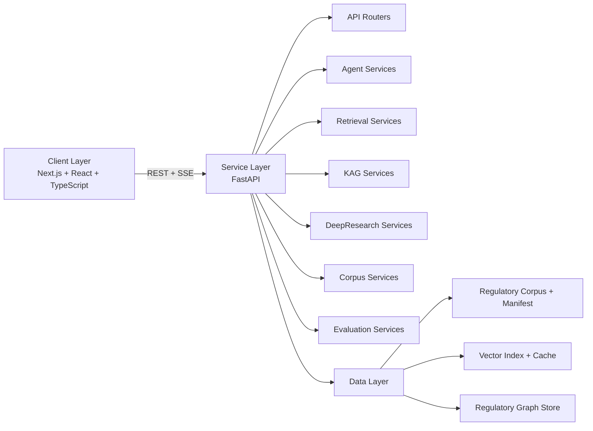

# HK-FinReg AI

<p align="center">
  <a href="./SECURITY.md"></a>
  
  
  
  
</p>

**HK-FinReg AI** is a compliance intelligence platform for Hong Kong financial regulation, designed for production-grade engineering workflows and research-grade methodological transparency. The system combines retrieval-augmented generation (RAG), knowledge-assisted generation (KAG), and multi-stage deep research orchestration to produce evidence-grounded regulatory analyses.

## Table of Contents

- [Executive Summary](#executive-summary)
- [Scope](#scope)
- [System Architecture](#system-architecture)
- [Methodology](#methodology)
- [API Surface](#api-surface)
- [Technology Stack](#technology-stack)
- [Installation](#installation)
- [Configuration](#configuration)
- [Development Workflow](#development-workflow)
- [Quality Assurance](#quality-assurance)
- [Data Governance and Security](#data-governance-and-security)
- [Reproducibility and Benchmarking](#reproducibility-and-benchmarking)
- [Repository Structure](#repository-structure)
- [Limitations](#limitations)
- [Citation](#citation)
- [License](#license)

## Executive Summary

HK-FinReg AI provides:

- End-to-end compliance analysis workflows across key financial scenarios.
- Hybrid retrieval and ranking for high-recall, high-precision evidence discovery.
- Knowledge graph reasoning for cross-document regulatory linkage.
- Streaming multi-agent execution with explicit intermediate states.
- Human review queue support for supervisory and expert escalation.
- Deterministic evaluation pipelines for benchmarking and regression tracking.

## Scope

The current implementation supports the following domain workflows:

- Stored Value Facility (SVF) compliance analysis
- Bank account onboarding and verification review
- Cross-border payment compliance assessment
- SME lending and credit-related compliance workflow
- DeepResearch for multi-step regulatory investigation
- Human-in-the-loop review queue continuation

## System Architecture



## Methodology

### 1. Retrieval and Evidence Formation

- Sparse retrieval (BM25) and dense retrieval are executed in parallel.
- Reciprocal Rank Fusion (RRF) merges candidate sets.
- Optional reranking refines ordering for evidence relevance.
- Citation verification validates evidential support before final synthesis.

### 2. Knowledge-Assisted Reasoning (KAG)

- The system derives a regulatory graph from corpus metadata and semantic relations.
- Graph traversal supports contextual expansion, dependency tracing, and regulatory linkage analysis.

### 3. DeepResearch Orchestration

- Query decomposition and plan generation
- Evidence acquisition and iterative gap detection
- Structured synthesis into analyst-facing compliance narratives

## API Surface

| Module | Endpoint | Contract |
| --- | --- | --- |
| SVF Compliance | `POST /api/v1/svf/analyze/stream` | SSE stream with intermediate agent events and final report |
| Bank Account | `POST /api/v1/bank-account/verify/stream` | SSE stream for onboarding/verification compliance |
| Cross-Border | `POST /api/v1/cross-border/assess/stream` | SSE stream for cross-border risk/compliance assessment |
| SME Lending | `POST /api/v1/sme/credit-rating/stream` | SSE stream for lending compliance workflow |
| DeepResearch | `POST /api/v1/research/analyze` | Structured multi-stage regulatory analysis output |
| Review Queue | `/api/v1/review-queue/*` | Human review continuation and stateful escalation |

## Technology Stack

| Layer | Technologies |
| --- | --- |
| Frontend | Next.js, React, TypeScript |
| Backend | FastAPI, Pydantic, SSE |
| Workflow Engine | LangGraph |
| Retrieval | ChromaDB, BM25, RRF |
| Graph | NetworkX |
| Reranking | Cohere (optional) |
| LLM/Embedding | Zhipu GLM family, LongCat, Zhipu Embeddings |
| Observability | LangSmith |

## Installation

### Python Backend Dependencies (Canonical Entrypoint)

Install backend dependencies from the repository root:

```bash
python -m pip install -r requirements.txt
```

`requirements.txt` is a thin entrypoint that delegates to `backend/requirements.txt`, which is the single source of truth for backend dependency versions.

### Frontend Dependencies

```bash
cd frontend
npm install
```

## Configuration

### Backend Environment

Create `backend/.env` from the project template and configure:

- Provider credentials (`ZHIPU_API_KEY`, `LONGCAT_API_KEY`, optional `COHERE_API_KEY`)
- Model and endpoint settings
- API security controls (`API_KEY_ENABLED`, `API_KEY`)
- Corpus/index/graph storage configuration
- Retrieval and DeepResearch feature toggles

### Frontend Environment

Configure `frontend/.env.local`:

- `NEXT_PUBLIC_API_BASE`
- `NEXT_PUBLIC_API_KEY`

## Development Workflow

### Backend

```bash
cd backend
python -m uvicorn app.main:app --host 0.0.0.0 --port 8000
```

### Frontend

```bash
cd frontend
npm install
npm run dev
```

## Quality Assurance

### Dependency Security Audit

```bash
python -m pip_audit -r requirements.txt
cd frontend && npm audit --omit=dev
```

### Automated Evaluation

```bash
cd backend
python -m app.services.evaluation.run_eval
```

### Test and Build Checks

```bash
python -m pytest backend/tests -q
cd frontend && npm run lint && npm run build
```

## Data Governance and Security

- Secrets and runtime credentials are excluded from version control.
- API key authentication is supported for service-layer access control.
- Evidence validation and citation checks are integrated into output generation.
- The repository includes dedicated security guidance in `SECURITY.md`.

## Reproducibility and Benchmarking

The benchmark framework is designed for deterministic regression monitoring across retrieval and synthesis components. For metric definitions and protocol details, refer to:

- `docs/evaluation_protocol.md`

## Repository Structure

```text
.
├─ backend/
│  ├─ app/
│  ├─ data/
│  └─ tests/
├─ frontend/
│  └─ src/
├─ docs/
├─ SECURITY.md
└─ README.md
```

## Limitations

- Model outputs may reflect source ambiguity and should be validated by qualified professionals.
- Regulatory interpretation is jurisdiction- and context-dependent.
- This system is decision-support infrastructure, not legal counsel.

## Citation

If you use this project in research or internal methodology reports, cite the repository and commit hash used for reproducibility.

## License

This project is distributed under the repository's license terms.
