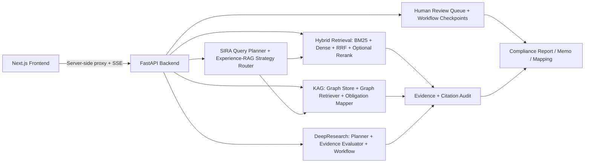

# HK-FinReg AI

<p align="center">
  <a href="./SECURITY.md"></a>
  
  
  
  
  
</p>

HK-FinReg AI is an internal Regulatory Intelligence and Compliance Operations Platform for Hong Kong banking teams.

It helps compliance, AML, KYC, product, legal, regulatory affairs, and audit teams run evidence-backed compliance reviews, policy impact analysis, regulatory research, obligation mapping, and human review workflows.

The platform combines:

- Hybrid regulatory retrieval with BM25, dense embeddings, reciprocal rank fusion, optional reranking, SIRA-style query planning, Experience-RAG strategy memory, and citation audit metadata.
- KAG, a regulatory knowledge graph layer for obligation, risk, control, regulator, and product mapping.
- DeepResearch workflows for multi-step planning, evidence gathering, gap analysis, and memo/report synthesis.
- Compliance Copilot, a context-aware bilingual assistant that routes user intent across RAG, KAG, DeepResearch, workflow recommendations, and human review support.
- Human-in-the-loop gates for low-confidence, missing-evidence, and manual-approval cases.

## Current Capabilities

### Bank Workspaces

The frontend organizes workflows into six bank ToB workspaces:

1. Customer & Account Compliance
2. Transaction & Payment Compliance
3. Product & Business Launch Review
4. Regulatory Research & Policy Change
5. Human Review & Audit
6. Regulatory Knowledge Base

### Workflow Routing

- Routine compliance review uses Hybrid RAG.
- Obligation, risk, and control mapping uses RAG + KAG.
- Product launch, AI governance, regulatory memo, and policy impact workflows use DeepResearch.
- Low-confidence and missing-evidence cases can pause for Human Review.
- Compliance Copilot classifies intent and routes to the appropriate backend tool path.

### Compliance Copilot

Compliance Copilot is implemented as a streaming chat assistant:

- Uses `MiMo-v2.5` through OpenAI-compatible model settings.
- Reads active workspace, workflow, input, report, evidence, graph, research plan, confidence, and review-gate context from the frontend.
- Streams SSE events: `intent`, `tool_call`, `evidence`, `graph`, `token`, `citation_audit`, and `done`.
- Produces a bilingual response contract with Traditional Chinese first and English second.
- Applies guardrails against final approval/rejection decisions and legal-advice claims.
- Surfaces unsupported-claim and low-confidence signals for audit-friendly review.

### Engineering Upgrades

- Evidence metadata includes RRF score and richer display fields for the Evidence Panel.
- SIRA-style query planning and Experience-RAG strategy metadata can be enabled to expand regulatory aliases, select retrieval recipes, and audit retrieval decisions.
- AI wealth advisory and product launch queries are expanded across HKMA, SFC, PCPD, consumer protection, suitability, and personal data signals.
- Evaluation separates classifier-side regulator coverage from evidence-side regulator coverage, so retrieval recall can be assessed independently from query classification.
- DeepResearch sub-question retrieval applies a regulator diversity gate to reduce PCPD-only evidence saturation when HKMA/SFC/PCPD evidence is available.
- Citation verifier returns explanation fields and audit summaries.
- KAG ontology and graph retrieval support obligation, risk, and control mapping.
- KAG APIs expose obligation mapping and graph search.
- DeepResearch request schema supports `task_type`, `output_format`, and `product_profile`.
- Obligation Mapper regression assets and release thresholds are wired into CI.
- Reranker cooldown handling reduces repeated external failures after Cohere `429` responses.
- Frontend API proxy keeps backend bearer tokens server-side.

## Architecture



## Regulatory Retrieval and Research Quality

The current retrieval stack is optimized for Hong Kong financial regulatory research where a user query often implies more than one regulator. For AI wealth advisory and product launch workflows, the classifier and query planner expand the query across:

- Regulators: `HKMA`, `SFC`, `PCPD`
- Topics: `AI`, `GenAI`, `ai_governance`, `wealth_management`, `consumer_protection`, `suitability`, `personal_data`
- Retrieval terms: `consumer protection`, `suitability`, `personal data`, `wealth management`, and regulator aliases

DeepResearch uses the same regulator intent when collecting sub-question evidence. After ranked retrieval, a regulator diversity gate selects available HKMA/SFC/PCPD evidence before filling the remaining slots by original rank. This keeps strong PCPD AI/privacy matches from crowding out banking, conduct, or suitability evidence when those sources exist.

Evaluation reports both:

- `classifier_regulator_coverage`: whether classifier filters include expected regulators.
- `evidence_regulator_coverage`: whether retrieved evidence metadata actually represents those regulators.

This split is intentional: classifier coverage can be healthy while evidence coverage reveals corpus, metadata, or retrieval diversity gaps.

## API Surface

### Streaming Compliance Workflows

- `POST /api/v1/svf/analyze/stream`
- `POST /api/v1/bank-account/verify/stream`
- `POST /api/v1/cross-border/assess/stream`
- `POST /api/v1/sme/credit-rating/stream`

These endpoints return SSE events such as `agent_state`, `token`, `confidence`, `checkpoint_saved`, `action_required`, `evidence_chunks`, `graph_paths`, `research_plan`, and `done`.

### Compliance Copilot API

- `POST /api/v1/copilot/chat/stream`

Copilot returns SSE events:

- `intent`
- `tool_call`
- `evidence`
- `graph`
- `token`
- `citation_audit`
- `done`

### KAG

- `POST /api/v1/kag/obligation-map`
- `POST /api/v1/kag/graph/search`

### DeepResearch

- `POST /api/v1/research/analyze`

Supported `task_type` values include:

- `routine_review`
- `product_launch_review`
- `ai_governance_review`
- `cross_regulator_analysis`
- `regulatory_memo`
- `checklist_generation`
- `regulatory_change_impact`

### Human Review and Operations

- `GET /api/v1/review-queue/pending`
- `POST /api/v1/review-queue/{workflow_run_id}/resume`
- `POST /api/v1/review-queue/{workflow_run_id}/reject`
- `GET /api/v1/health`
- `GET /api/v1/metrics`

Most business endpoints are protected by bearer-token API key validation when `API_KEY_ENABLED=True`.

## Repository Layout

```text
.
|-- backend/
|   |-- app/
|   |   |-- api/routers/          # FastAPI routes
|   |   |-- core/                 # configuration, security, monitoring
|   |   |-- schemas/              # request/response models
|   |   `-- services/             # agents, retrieval, KAG, DeepResearch, Copilot
|   |-- data/                     # regulatory source manifest, indexes, graph data
|   `-- tests/                    # backend unit/regression tests
|-- frontend/
|   |-- src/app/                  # Next.js app and API proxy
|   |-- src/components/           # dashboard, evidence, report, graph, chat UI
|   |-- src/hooks/                # streaming workflow and Copilot hooks
|   |-- src/lib/                  # workspace config, routing, report formatting
|   `-- scripts/                  # workspace validation
|-- docs/
|   |-- product/                  # product architecture and Copilot notes
|   `-- superpowers/plans/        # implementation plans
|-- .github/workflows/            # release gates
|-- requirements.txt              # root backend dependency entrypoint
|-- SECURITY.md
`-- README.md
```

## Prerequisites

- Python 3.11+
- Node.js 20+
- npm
- Model/API credentials for the configured OpenAI-compatible endpoints
- Optional Cohere API key for reranking
- Optional LangSmith credentials for tracing

## Installation

### Backend Installation

```bash
python -m pip install --upgrade pip
python -m pip install -r requirements.txt
```

The root `requirements.txt` delegates to `backend/requirements.txt`, which is the canonical backend dependency list.

### Frontend Installation

```bash
cd frontend
npm install
```

## Configuration

### Backend Configuration

Create `backend/.env` from `backend/.env.example`:

```bash
cd backend
cp .env.example .env
```

Configure at least:

- `ZHIPU_API_KEY` and/or `LONGCAT_API_KEY`
- `ZHIPU_BASE_URL`, `LONGCAT_BASE_URL`, `ZHIPU_MODEL`, and `LONGCAT_MODEL`
- Embedding settings: `EMBEDDING_PROVIDER`, `EMBEDDING_MODEL`, `EMBEDDING_BASE_URL`, `EMBEDDING_API_KEY`, `EMBEDDING_DIMENSIONS`
- Copilot settings: `COPILOT_MODEL`, `COPILOT_BASE_URL`, `COPILOT_API_KEY`, `COPILOT_TIMEOUT_SECONDS`, `COPILOT_MAX_CONTEXT_CHARS`, `COPILOT_MAX_HISTORY_MESSAGES`
- Optional retrieval planning settings: `SIRA_QUERY_PLANNER_ENABLED`, `SIRA_TERM_STATS_PATH`, `EXPERIENCE_RAG_ENABLED`, `EXPERIENCE_RAG_MEMORY_PATH`, `EXPERIENCE_RAG_RECORDING_ENABLED`, `EXPERIENCE_RAG_MAX_RECORDS`
- `API_KEY_ENABLED` and `API_KEY`
- Optional `COHERE_API_KEY`
- Optional LangSmith variables: `LANGCHAIN_TRACING_V2`, `LANGCHAIN_ENDPOINT`, `LANGCHAIN_API_KEY`, `LANGCHAIN_PROJECT`
- CORS settings for deployed frontend origins

### Frontend Configuration

Create `frontend/.env.local` from `frontend/.env.example`:

```bash
cd frontend
cp .env.example .env.local
```

Configure:

- `BACKEND_API_BASE`, usually `http://127.0.0.1:8000` for local development.
- `BACKEND_API_KEY`, which should match backend `API_KEY` when API key validation is enabled.

Do not expose backend credentials with a `NEXT_PUBLIC_` prefix.

## Local Development

Start the backend:

```bash
cd backend
python -m uvicorn app.main:app --host 127.0.0.1 --port 8000 --reload
```

Start the frontend:

```bash
cd frontend
npm run dev -- --hostname 127.0.0.1 --port 3000
```

Open:

- Frontend: `http://127.0.0.1:3000`
- Backend health check: `http://127.0.0.1:8000/api/v1/health`
- Backend Swagger UI, only when `DEBUG=True`: `http://127.0.0.1:8000/docs`

## Testing and Quality Gates

### Backend Tests

```bash
python -m pytest backend/tests -q
```

### Frontend Checks

```bash
cd frontend
npm run validate:workspaces
npm run lint
npm run build
```

### Retrieval/KAG Evaluation

```bash
cd backend
python -m app.services.evaluation.run_eval
```

The deterministic evaluation summary includes:

- `retrieval_mode_accuracy`
- `avg_topic_coverage`
- `avg_classifier_regulator_coverage`
- `avg_evidence_regulator_coverage`
- `strategy_accuracy`
- `avg_expansion_term_coverage`
- `avg_citation_supported_rate`
- `avg_unsupported_claim_rate`
- `avg_deepresearch_gap_count`

See [docs/evaluation_protocol.md](./docs/evaluation_protocol.md) for metric definitions and interpretation.

### Regulatory Optimization Tests

```bash
cd backend
python -m pytest tests/test_query_classifier.py tests/test_query_planner.py tests/test_deepresearch.py tests/test_evaluation_error_reporting.py tests/test_regulatory_optimization_pipeline.py -q
```

These tests cover:

- AI wealth advisory/product launch regulator and topic expansion.
- Query planner expansion for HKMA/SFC/PCPD, consumer protection, suitability, personal data, and wealth management.
- Separate classifier and evidence regulator coverage metrics.
- DeepResearch regulator diversity gate behavior.
- Concurrency determinism for the optimized classifier/planner/gate path.
- Retrieval recall under PCPD-heavy ranking using a deterministic fake retriever.
- Fallback report generation preserving diverse regulator evidence and supported citations.

### Obligation Mapper Regression Gate

```bash
cd backend
python -m app.services.evaluation.run_obligation_mapper_regression
```

The regression gate writes:

- `backend/tests/regression/obligation_mapper/latest_regression_report.json`

Current release thresholds:

- Regulator Coverage >= 0.90
- Obligation Coverage >= 0.85
- Evidence Support Rate >= 0.90
- Structured Output Validity = 1.00

### CI

`.github/workflows/release-gates.yml` runs:

1. Backend test suite
2. Obligation Mapper regression gate
3. Frontend lint and build

## Runtime Notes

- The backend defaults to `DEBUG=False`; Swagger and `/test` are only exposed when debug mode is enabled.
- `API_KEY_ENABLED=True` is the secure default for business APIs.
- The frontend talks to the backend through `/api/backend/...`; the proxy allowlist intentionally exposes only known backend paths.
- If Cohere rerank returns `429`, the system cools down and falls back to top-k retrieval without reranking.
- Some historical source comments/docstrings still contain mojibake, but the runtime APIs and user-facing README have been normalized.
- This project is decision-support tooling for internal compliance analysis. It is not legal advice and must not be treated as final regulatory approval.

## Security

See [SECURITY.md](./SECURITY.md) for security policy and reporting guidance.

## License

This project is distributed under the repository's license terms.
