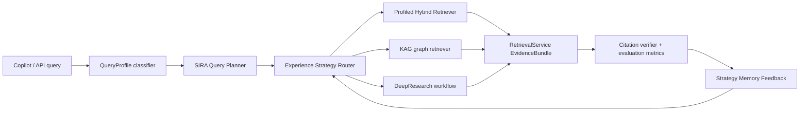

# SIRA-Style Retrieval Enhancement and Experience-RAG Strategy Memory Implementation Plan

> **For agentic workers:** REQUIRED SUB-SKILL: Use superpowers:subagent-driven-development (recommended) or superpowers:executing-plans to implement this plan task-by-task. Steps use checkbox (`- [ ]`) syntax for tracking.

**Goal:** Add a SIRA-style query planning layer and an Experience-RAG strategy memory layer to improve HK-FinReg AI retrieval recall, routing quality, and auditability without replacing the current Hybrid RAG, KAG, DeepResearch, or citation verification stack.

**Architecture:** Keep the existing `HybridRetriever`, `RetrievalService`, `route_tools`, and evaluation protocol as the backbone. Insert a small query-planning layer before retrieval and a strategy memory layer around routing/retrieval so each query can choose, explain, and later learn from its retrieval strategy.

**Tech Stack:** FastAPI backend, LangChain retrievers, BM25 + Chroma dense retrieval, optional Cohere rerank, Pydantic schemas, pytest, existing evaluation scripts.

## Global Constraints

- Preserve current retrieval surfaces: `RetrievalService.retrieve(...)`, `route_and_retrieve(...)`, and Copilot `route_tools(...)` must remain backward compatible.
- Treat regulatory source metadata and citation provenance as first-class audit fields.
- Do not require a new vector database or model provider for the first implementation.
- All strategy choices must be deterministic by default and testable without external LLM calls.
- New behavior must be feature-flagged so the system can fall back to the current Hybrid RAG path.
- No PII may be stored in strategy memory; use existing `pii_scrubber` before persisting query text or fingerprints.
- Evaluation must cover recall proxies, source precision, routing decisions, and citation audit effects.

---

## Why These Two Methods Fit This Project

### SIRA-Style Retrieval Enhancement

SIRA, published in May 2026, shows that retrieval can improve when an agent plans corpus-discriminative query terms instead of relying only on the user's raw wording. The practical idea for this project is:

- Build an offline vocabulary/term-statistics artifact from the regulatory corpus.
- At request time, expand the query with regulator names, product terms, obligation words, section aliases, and high-IDF regulatory terms.
- Filter overly common or ambiguous expansions with document-frequency thresholds.
- Feed the expanded query into the existing BM25 + dense + RRF pipeline.

This maps directly to the current `HybridRetriever` in `backend/app/services/agents/builder.py`, especially because BM25 already exists and the project already exposes RRF scores.

Reference: https://arxiv.org/abs/2605.06647

### Experience-RAG Strategy Memory

Experience-RAG, published in May 2026, treats retrieval as a strategy selection problem. Instead of asking "what documents match this query?", it first asks "what kind of query is this, what has worked for similar cases, and which retrieval recipe should be used?"

For HK-FinReg AI, that means recording which retrieval strategy worked for:

- Clause lookup
- KYC/AML obligation questions
- AI governance questions
- Cross-regulator impact analysis
- Human-review gap explanation
- Product launch checklist generation

Reference: https://arxiv.org/abs/2605.03989

---

## Target Architecture



### New Conceptual Units

1. `QueryPlan`
   - Holds raw query, scrubbed query, expansion terms, rewritten BM25 query, dense query, filters, and explanation.
   - Produced by SIRA-style planner.

2. `RetrievalStrategy`
   - Holds retrieval mode, BM25/Dense weights, rerank settings, top-k values, graph usage, DeepResearch allowance, and reason codes.
   - Produced by Experience strategy router.

3. `StrategyExperience`
   - Holds a scrubbed query fingerprint, strategy id, observed metrics, citation audit summary, and optional human-review outcome.
   - Persisted as JSONL or SQLite in the first implementation.

---

## File Structure

### Create

- `backend/app/services/retrieval/query_planner.py`
  - SIRA-style deterministic query expansion and query-plan construction.

- `backend/app/services/retrieval/term_statistics.py`
  - Offline corpus term statistics loader/builder with document-frequency metadata.

- `backend/app/services/retrieval/strategy_memory.py`
  - Experience-RAG memory store, query fingerprinting, metric recording, and nearest-experience lookup.

- `backend/app/services/retrieval/strategy_router.py`
  - Converts `QueryProfile` + `QueryPlan` + prior experiences into a concrete `RetrievalStrategy`.

- `backend/tests/test_query_planner.py`
  - Unit tests for term filtering, bilingual expansion, and audit explanations.

- `backend/tests/test_strategy_memory.py`
  - Unit tests for PII scrubbing, persistence, nearest lookup, and metric aggregation.

- `backend/tests/test_strategy_router.py`
  - Unit tests for strategy selection across clause lookup, AML/KYC, AI governance, and DeepResearch cases.

- `docs/product/sira-experience-rag.md`
  - Product/architecture note for compliance, audit, and release gates.

### Modify

- `backend/app/core/config.py`
  - Add feature flags and file paths.

- `backend/.env.example`
  - Document the flags.

- `backend/app/schemas/evidence.py`
  - Add optional strategy/query-plan audit metadata to `EvidenceBundle` or chunk metadata without breaking callers.

- `backend/app/services/retrieval/retrieval_service.py`
  - Accept optional `query_plan` and `strategy` arguments; keep existing signature behavior compatible.

- `backend/app/services/retrieval/retrieval_router.py`
  - Apply query planning and strategy routing before retrieval.

- `backend/app/services/copilot/tool_router.py`
  - Use the new router for `regulatory_qa`, `obligation_mapping`, and `case_explanation`.

- `backend/app/services/evaluation/rag_eval.py`
  - Add strategy-level metrics: expansion coverage, strategy id, citation-supported delta, and source precision.

- `docs/evaluation_protocol.md`
  - Document the new benchmark fields and release thresholds.

---

## Implementation Phases

### Phase 0: Baseline and Release Gates

Purpose: establish a measurable baseline before changing retrieval.

- [ ] Run current backend retrieval tests:

```powershell
cd F:\MyFintech\backend
python -m pytest tests/test_retrieval_router.py tests/test_rrf_scoring.py tests/test_query_classifier.py tests/test_citation_verifier.py -q
```

- [ ] Run the current deterministic evaluation:

```powershell
cd F:\MyFintech\backend
python -m app.services.evaluation.run_eval
```

- [ ] Save baseline metrics manually in the PR/implementation notes:
  - `retrieval_mode_accuracy`
  - `topic_coverage`
  - `regulator_coverage`
  - `citation_supported_rate`
  - `unsupported_claim_rate`
  - `evidence_count`

Acceptance gate:

- No implementation starts until the existing baseline is known.
- New release gate should require no drop in `citation_supported_rate` and no increase in `unsupported_claim_rate`.

### Phase 1: SIRA-Style Query Planner

Purpose: improve sparse retrieval recall and bilingual regulatory term matching.

Design:

- Build corpus term statistics from already loaded regulatory documents.
- Use deterministic expansion rules first:
  - Regulator aliases: `HKMA`, `Hong Kong Monetary Authority`, `金管局`
  - Topic aliases: `AML`, `CFT`, `CDD`, `KYC`, `洗錢`, `客戶盡職審查`
  - Obligation terms: `must`, `shall`, `required`, `obligation`, `control`, `審查`, `要求`
  - Product/workflow terms from active workspace and `QueryProfile.filters`
- Apply document-frequency bounds:
  - Reject terms with `df_ratio > 0.35` unless they are exact regulator/product aliases.
  - Reject terms with `df_ratio < 0.002` unless they appear in the user query or metadata filters.
- Return both `bm25_query` and `dense_query`.
  - BM25 query gets exact aliases and high-IDF terms.
  - Dense query stays closer to natural language to avoid semantic drift.

Key interface:

```python
class QueryPlan(BaseModel):
    raw_query: str
    scrubbed_query: str
    bm25_query: str
    dense_query: str
    expansion_terms: list[str]
    filters: dict[str, list[str]]
    reasons: list[str]
```

Integration:

- Update `HybridRetriever` to accept either a string query or a `QueryPlan` through a wrapper.
- Use `bm25_query` for BM25 retrieval.
- Use `dense_query` for dense retrieval.
- Keep current raw-string behavior as fallback.

Tests:

- Query: `What are SVF CDD requirements?`
  - Expected expansions include `stored value facility`, `CDD`, `customer due diligence`, `HKMA`.
- Query: `AI wealth advisory product launch`
  - Expected expansions include `AI`, `GenAI`, `product launch`, `governance`.
- Chinese query with AML/KYC terms must produce bilingual expansions and keep scrubbed text.

Acceptance gate:

- Existing retrieval router tests still pass.
- New query-planner tests pass without external network calls.
- Evidence metadata includes `query_plan.expansion_terms` or equivalent audit field.

### Phase 2: Experience-RAG Strategy Memory

Purpose: choose retrieval recipes based on query type and observed prior outcomes.

Design:

- Start with deterministic strategy ids:
  - `clause_lookup_sparse_heavy`
  - `aml_kyc_balanced_rerank`
  - `ai_governance_kag`
  - `cross_regulator_deepresearch`
  - `case_explanation_context_first`
- Persist experience records after retrieval/evaluation:

```python
class StrategyExperience(BaseModel):
    query_fingerprint: str
    query_traits: list[str]
    strategy_id: str
    retrieval_mode: str
    bm25_weight: float
    dense_weight: float
    top_k: int
    evidence_count: int
    citation_supported_rate: float | None = None
    unsupported_claim_rate: float | None = None
    source_precision: float | None = None
    human_review_outcome: str | None = None
    created_at: str
```

- Store first version as JSONL:
  - `data/strategy_memory/retrieval_experiences.jsonl`
  - Easy to inspect, diff, redact, and reset.

- Strategy selection:
  - Use `classify_query(...)` for initial mode.
  - Use SIRA `QueryPlan` reasons and filters as traits.
  - Look up recent similar experiences by traits and query fingerprint similarity.
  - If no experience exists, use deterministic default strategy.
  - If experience exists, prefer strategies with higher supported-citation rate and source precision.

Acceptance gate:

- No raw PII stored.
- Memory lookup is deterministic.
- If memory file is missing or corrupt, router falls back to deterministic defaults and emits a warning.

### Phase 3: Retrieval Router Integration

Purpose: make SIRA + strategy memory usable from current APIs.

Integration path:

1. In `route_and_retrieve(...)`:
   - classify query
   - build query plan
   - select retrieval strategy
   - retrieve evidence
   - attach strategy audit metadata
   - record experience after citation/evaluation data is available

2. In `tool_router.py`:
   - `regulatory_qa`: use strategy-aware RAG
   - `obligation_mapping`: use strategy-aware KAG + RAG
   - `case_explanation`: prefer case evidence, then strategy-aware augmentation
   - `deep_research`: keep current workflow but pass query plan into sub-question retrieval in a later phase

3. In `RetrievalService.retrieve(...)`:
   - preserve current parameters
   - add optional keyword-only parameters:

```python
def retrieve(
    self,
    query: str,
    filters: dict[str, Any] | None = None,
    retrieval_mode: str = "rag",
    top_k: int = 5,
    *,
    query_plan: QueryPlan | None = None,
    strategy: RetrievalStrategy | None = None,
) -> list[EvidenceChunk]:
    ...
```

Acceptance gate:

- All existing callers continue working.
- Copilot SSE payloads remain backward compatible.
- Evidence panel can ignore new metadata if the frontend is not updated yet.

### Phase 4: Evaluation and Regression Expansion

Purpose: prove the change improves retrieval rather than merely making it more complex.

Add benchmark fields to `data/evaluation/benchmark_questions.json`:

```json
{
  "id": "RAG_SVF_CDD_SIRA_001",
  "question": "What are SVF CDD requirements?",
  "expected_retrieval_mode": "rag",
  "expected_strategy_id": "aml_kyc_balanced_rerank",
  "expected_expansion_terms": ["CDD", "customer due diligence", "SVF", "HKMA"],
  "expected_topics": ["AML", "CDD", "KYC", "SVF"],
  "expected_regulators": ["HKMA"]
}
```

New metrics:

- `strategy_accuracy`
- `expansion_term_coverage`
- `query_plan_drift_rate`
- `source_precision_delta`
- `citation_supported_rate_delta`
- `unsupported_claim_rate_delta`

Release thresholds:

- `strategy_accuracy >= 0.80` on benchmark cases.
- `expansion_term_coverage >= 0.70` for SIRA-tagged cases.
- `unsupported_claim_rate` must not increase from baseline.
- `citation_supported_rate` must not decrease from baseline.
- `source_precision` must not decrease by more than 0.05.

### Phase 5: Observability and Operations

Purpose: make the feature explainable to compliance and safe to operate.

Add logs/metadata:

- `query_plan_id`
- `strategy_id`
- `expansion_terms`
- `rejected_terms`
- `strategy_reason_codes`
- `memory_hit`
- `experience_recorded`

Operational controls:

- `SIRA_QUERY_PLANNER_ENABLED`
- `SIRA_TERM_STATS_PATH`
- `EXPERIENCE_RAG_ENABLED`
- `EXPERIENCE_RAG_MEMORY_PATH`
- `EXPERIENCE_RAG_RECORDING_ENABLED`
- `EXPERIENCE_RAG_MAX_RECORDS`

Rollout:

1. Start disabled by default in production.
2. Enable SIRA planner only in staging.
3. Enable strategy memory lookup in staging with recording off.
4. Enable recording after redaction tests pass.
5. Enable production for Copilot `regulatory_qa`.
6. Expand to `obligation_mapping`.
7. Expand to DeepResearch sub-question retrieval only after benchmark gains are stable.

Rollback:

- Disable `SIRA_QUERY_PLANNER_ENABLED`.
- Disable `EXPERIENCE_RAG_ENABLED`.
- Preserve memory file for audit unless it contains a redaction issue; if so, archive and rotate according to security policy.

---

## Suggested Task Breakdown

### Task 1: Add Feature Flags and Schemas

**Files:**
- Modify: `backend/app/core/config.py`
- Modify: `backend/.env.example`
- Modify: `backend/app/schemas/evidence.py`
- Create: `backend/app/services/retrieval/query_planner.py`
- Create: `backend/app/services/retrieval/strategy_router.py`
- Create: `backend/app/services/retrieval/strategy_memory.py`

**Deliverable:** Importable Pydantic models and disabled-by-default settings.

**Test command:**

```powershell
cd F:\MyFintech\backend
python -m pytest tests/test_retrieval_router.py -q
```

### Task 2: Implement Term Statistics and Query Planner

**Files:**
- Create: `backend/app/services/retrieval/term_statistics.py`
- Modify: `backend/app/services/retrieval/query_planner.py`
- Create: `backend/tests/test_query_planner.py`

**Deliverable:** Deterministic SIRA-style expansion with DF filtering and bilingual regulatory aliases.

**Test command:**

```powershell
cd F:\MyFintech\backend
python -m pytest tests/test_query_planner.py -q
```

### Task 3: Add Strategy Router Defaults

**Files:**
- Modify: `backend/app/services/retrieval/strategy_router.py`
- Create: `backend/tests/test_strategy_router.py`

**Deliverable:** Query traits map to stable strategy ids and BM25/Dense weights.

**Test command:**

```powershell
cd F:\MyFintech\backend
python -m pytest tests/test_strategy_router.py tests/test_query_classifier.py -q
```

### Task 4: Add Strategy Memory Store

**Files:**
- Modify: `backend/app/services/retrieval/strategy_memory.py`
- Create: `backend/tests/test_strategy_memory.py`

**Deliverable:** JSONL experience store with PII scrubbing, append-only writes, bounded reads, and corrupt-line tolerance.

**Test command:**

```powershell
cd F:\MyFintech\backend
python -m pytest tests/test_strategy_memory.py -q
```

### Task 5: Integrate Planner and Strategy into Retrieval

**Files:**
- Modify: `backend/app/services/retrieval/retrieval_service.py`
- Modify: `backend/app/services/retrieval/retrieval_router.py`
- Modify: `backend/app/services/agents/builder.py`
- Modify: `backend/tests/test_retrieval_router.py`

**Deliverable:** Existing retrieval calls remain compatible; enabled paths attach query-plan and strategy metadata.

**Test command:**

```powershell
cd F:\MyFintech\backend
python -m pytest tests/test_retrieval_router.py tests/test_rrf_scoring.py tests/test_query_planner.py tests/test_strategy_router.py -q
```

### Task 6: Integrate Copilot Routes

**Files:**
- Modify: `backend/app/services/copilot/tool_router.py`
- Modify: `backend/tests/test_copilot_tool_router.py`

**Deliverable:** Copilot regulatory QA, obligation mapping, and case explanation use strategy-aware retrieval when enabled.

**Test command:**

```powershell
cd F:\MyFintech\backend
python -m pytest tests/test_copilot_tool_router.py tests/test_copilot_api.py -q
```

### Task 7: Expand Evaluation Protocol

**Files:**
- Modify: `backend/app/services/evaluation/rag_eval.py`
- Modify: `backend/app/services/evaluation/run_eval.py`
- Modify: `data/evaluation/benchmark_questions.json`
- Modify: `docs/evaluation_protocol.md`

**Deliverable:** Evaluation reports strategy accuracy, expansion coverage, and citation/source deltas.

**Test command:**

```powershell
cd F:\MyFintech\backend
python -m app.services.evaluation.run_eval
```

### Task 8: Documentation and Rollout Notes

**Files:**
- Create: `docs/product/sira-experience-rag.md`
- Modify: `README.md`

**Deliverable:** Product-facing explanation, audit metadata description, feature flags, rollout, and rollback.

**Verification command:**

```powershell
cd F:\MyFintech
Select-String -Path docs/product/sira-experience-rag.md,README.md -Pattern "SIRA","Experience-RAG","SIRA_QUERY_PLANNER_ENABLED","EXPERIENCE_RAG_ENABLED"
```

---

## Risks and Mitigations

| Risk | Mitigation |
|---|---|
| Query expansion causes semantic drift | Keep dense query close to original text; expose rejected/accepted expansion terms; gate by citation metrics. |
| Strategy memory stores sensitive data | Store scrubbed query fingerprints and traits, not raw PII; add tests for redaction. |
| More routing layers make debugging harder | Attach `query_plan` and `strategy` metadata to evidence bundles and logs. |
| Existing tests depend on raw retrieval behavior | Feature flags default off; preserve current method signatures. |
| Experience memory overfits early bad outcomes | Start with recording disabled, then lookup disabled, then enable after benchmark and audit review. |

---

## Definition of Done

- SIRA planner can expand bilingual HK regulatory queries deterministically.
- Strategy router can select stable retrieval recipes with explicit reason codes.
- Strategy memory can record and retrieve prior strategy outcomes without storing raw PII.
- Existing RAG/KAG/DeepResearch/Copilot behavior remains backward compatible when flags are off.
- Evaluation reports strategy and expansion metrics.
- Release thresholds prevent citation quality regression.
- Documentation explains audit metadata, feature flags, rollout, and rollback.

---

## Self-Review Notes

- Scope is intentionally limited to retrieval planning and strategy memory; it does not replace KAG, DeepResearch, embeddings, reranking, or the frontend.
- First release does not require LLM-generated query expansion. Deterministic aliases and corpus statistics are safer for compliance and easier to test.
- JSONL memory is chosen for inspectability and rollback; SQLite can be a later optimization if concurrency or query volume requires it.
- The plan preserves existing APIs and enables progressive rollout through feature flags.
