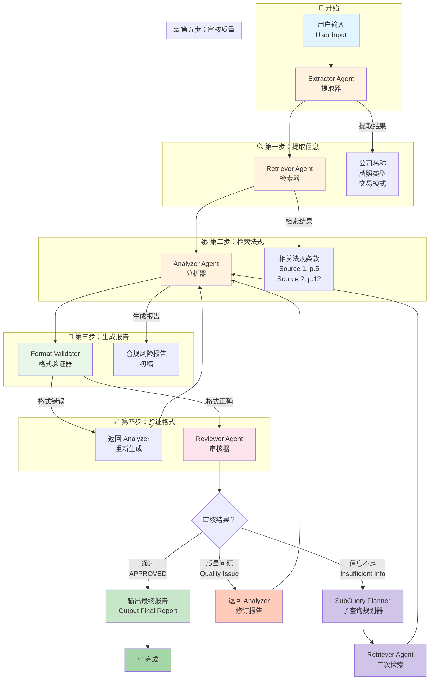

```mermaid
flowchart TB
    subgraph 开始 [🚀 开始]
        A[用户输入<br/>User Input] --> B
    end

    subgraph 第一步 [🔍 第一步：提取信息]
        B[Extractor Agent<br/>提取器] --> C
        B -->|提取结果| B1[公司名称<br/>牌照类型<br/>交易模式]
    end

    subgraph 第二步 [📚 第二步：检索法规]
        C[Retriever Agent<br/>检索器] --> D
        C -->|检索结果| C1[相关法规条款<br/>Source 1, p.5<br/>Source 2, p.12]
    end

    subgraph 第三步 [🧠 第三步：生成报告]
        D[Analyzer Agent<br/>分析器] --> E
        D -->|生成报告| D1[合规风险报告<br/>初稿]
    end

    subgraph 第四步 [✅ 第四步：验证格式]
        E[Format Validator<br/>格式验证器]
        E -->|格式错误| E1[返回 Analyzer<br/>重新生成]
        E -->|格式正确| F
        E1 --> D
    end

    subgraph 第五步 [⚖️ 第五步：审核质量]
        F[Reviewer Agent<br/>审核器]
    end

    F --> G{审核结果？}

    G -->|通过<br/>APPROVED| H[输出最终报告<br/>Output Final Report]
    G -->|质量问题<br/>Quality Issue| I[返回 Analyzer<br/>修订报告]
    G -->|信息不足<br/>Insufficient Info| J[SubQuery Planner<br/>子查询规划器]

    I --> D
    J --> K[Retriever Agent<br/>二次检索]
    K --> D

    H --> L[✅ 完成]

    style A fill:#e1f5fe
    style B fill:#fff3e0
    style C fill:#fff3e0
    style D fill:#fff3e0
    style E fill:#e8f5e9
    style F fill:#fce4ec
    style H fill:#c8e6c9
    style I fill:#ffccbc
    style J fill:#d1c4e9
    style K fill:#d1c4e9
    style L fill:#a5d6a7
```
